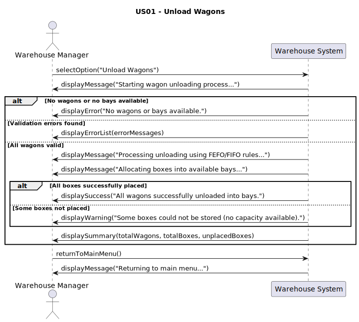
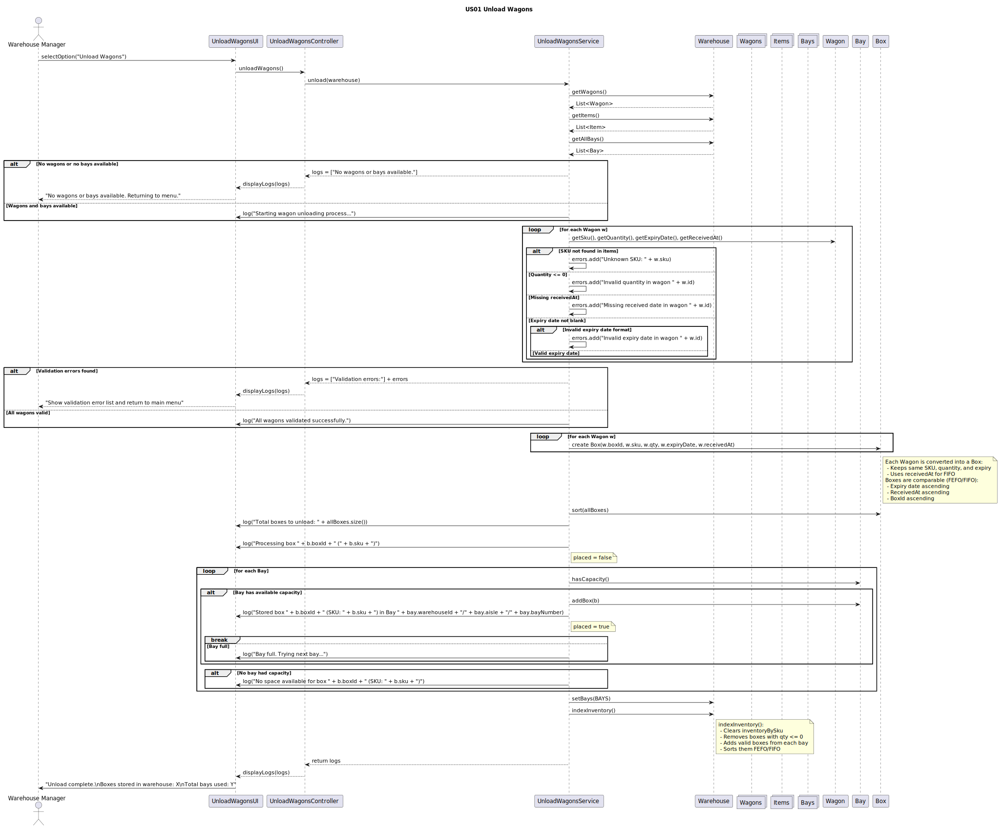

### User Story 01 -  Unloading Wagons

As a terminal operator, I want unloading operations of wagons to
automatically store inventory using FEFO and/or FIFO logic, so that I can ensure
the correct dispatch order and minimize product spoilage.

### Introduction

This user story defines the automatic unloading process of wagons into warehouse bays.
The goal is to ensure accurate stock registration and proper product rotation using FEFO (First-Expired, First-Out) and FIFO (First-In, First-Out) principles.
This automation minimizes manual errors, reduces waste, and maintains product traceability across warehouses.

### Acceptance Criteria

1. Stock initialization/unloading wagons - The file wagons.csv contains the available stock per SKU. Each wagon’s contents should be assigned to an aisle/bay,
and their products must be inserted into the correct position inside the bay
accordingly to the following rules:
(a) boxes are ordered by expiry date (earliest first; null last)
(b) receivedAt (oldest first)
(c) boxId ASC (tie-break)

2. Dispatch operation - The operation dispatch must always consume stock from
the “front” of the bay list, guaranteeing FEFO/FIFO behaviour. If a bay
becomes empty, it remains in the WMS (the bay still exists), but the box list
is empty; only delete empty boxes, not bays. Partial dispatch across multiple
bays must be supported: if the target bay runs out, continue in the next bay,
ascending number, that holds that SKU.

3. Relocation - The operation relocation must update a box’s warehouseId/aisle/bay
only; do not re-sort its new bay if its expiryDate/receivedAt is unchanged except for inserting it into the new bay’s FEFO position.

### Returns

After execution, the system produces a sequence of log messages describing each stage of the unloading process — including validation, box creation, storage allocation, and final summary.  
Each valid wagon is converted into a `Box` and placed in the appropriate `Bay` according to FEFO/FIFO rules.  
If any validation errors occur (such as missing data, invalid expiry dates, or unknown SKUs), they are listed in the log output and no boxes are stored.  
The warehouse state (`Warehouse`) is updated accordingly, with boxes sorted and indexed by expiry date, received date, and box ID.  
A final summary message confirms whether all wagons were successfully unloaded or if any boxes could not be stored due to lack of space.

### Diagrams

## System Sequence Diagram

## Class Diagram

## Sequence Diagram

#### Done 

**Unloading**  
The system successfully processes the `wagons.csv` file, validating all wagon records (`SKU`, `quantity`, `expiryDate`, and `receivedAt`).  
Each valid wagon is converted into a `Box` object and automatically assigned to the first available bay with capacity.  
Boxes inside each bay are maintained in **FEFO/FIFO order**, determined by:
1. **Expiry date** – earliest first (FEFO principle)  
2. **ReceivedAt** – oldest first (FIFO fallback)  
3. **BoxId** – ascending order (tie-breaker)  
After all boxes are processed, the warehouse inventory index (`inventoryBySku`) is rebuilt, reflecting all stored boxes and ensuring real-time stock visibility.

**Dispatch**  
The dispatch operation retrieves boxes from the **front of each bay’s list**, always respecting FEFO/FIFO logic.  
If the requested quantity exceeds the current bay’s available stock, the system automatically continues dispatching from the **next available bay** containing the same SKU.  
When a box becomes empty, it is deleted; however, empty bays remain registered in the WMS for traceability and reuse.  
This guarantees consistent stock rotation and prevents premature product expiry.

**Relocation**  
Boxes can be relocated between bays, aisles, or warehouses.  
During relocation, only the box’s **location attributes** (`warehouseId`, `aisle`, `bay`) are updated.  
If `expiryDate` and `receivedAt` remain unchanged, the box is inserted directly into the target bay’s FEFO position without re-sorting the entire bay.  
This preserves both **performance** and **data integrity** across warehouse operations.

**Quality**  
All operations — *unloading*, *dispatch*, and *relocation* — execute reliably under multiple scenarios (empty inputs, invalid data, full bays, multiple warehouses).  
Comprehensive automated test coverage ensures that:  
- FEFO/FIFO ordering is consistently preserved.  
- Inventory remains synchronized and accurate after each operation.  
- Validation and logging mechanisms guarantee full **traceability** and **auditability**.  
- The system passes all **unit**, **integration**, and **stress** tests successfully.

### Test Cases

| **Test Name** | **Description** | **Expected Result** |
|----------------|-----------------|---------------------|
| **Controller Initialization** | Check if the controller starts correctly with a warehouse. | Controller is created successfully. |
| **Delegates to Service** | Ensure the controller runs the service to unload wagons. | Log shows “Stored box”. |
| **Validation Errors** | Test if invalid wagons trigger error messages. | Log shows “Validation errors”. |
| **Empty Warehouse** | Run when there are no wagons or bays. | Log shows “No wagons or bays available.” |
| **Inventory Updated** | Check if warehouse inventory updates after unload. | Boxes appear in warehouse inventory. |
| **Multiple Wagons** | Unload several wagons at once. | Log shows multiple “Stored box” messages. |
| **Multiple Warehouses** | Unload wagons into bays of different warehouses. | Boxes are stored across both warehouses. |
| **Unknown SKU** | Try unloading a wagon with a non-existing SKU. | Log shows “Unknown SKU”. |
| **Invalid Quantity** | Try unloading a wagon with zero or negative quantity. | Log shows “Invalid quantity”. |
| **Invalid Expiry Date** | Wagon has invalid expiry date format. | Log shows “Invalid expiry date”. |
| **Missing Received Date** | Wagon has no received date. | Log shows “Missing received date”. |
| **Successful Unload** | Normal unload with valid data. | Log shows “Stored box” and box is saved. |
| **FEFO Order** | Boxes sorted by expiry date (earliest first). | Correct FEFO order in bays. |
| **FIFO Order** | Boxes without expiry sorted by received date. | Correct FIFO order in bays. |
| **Bay Capacity Limit** | Bays full — try adding more boxes. | Log shows “No space available.” |
| **Inventory Indexed** | After unload, check inventory map. | SKU appears in inventory list. |
| **Large Number of Wagons** | Stress test with many wagons. | Logs show “Total boxes to unload” and many “Stored box” lines. |
| **Expired Items** | Include expired and valid wagons. | Expired boxes handled without crash. |
| **Summary Log** | Check if logs end with summary info. | Log includes “Total boxes to unload”. |
| **Validation Failure Stops Storage** | Invalid data should stop box storage. | No boxes stored; log shows “Validation errors”. |