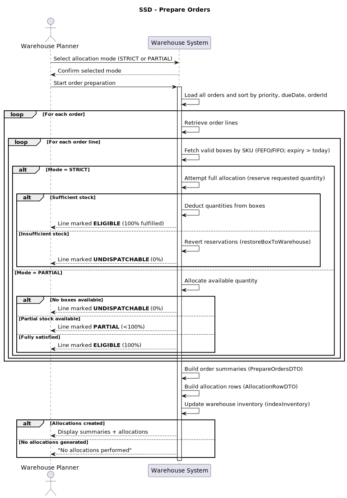
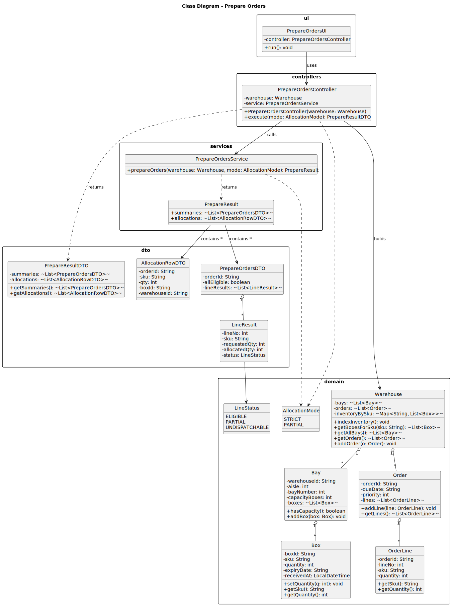
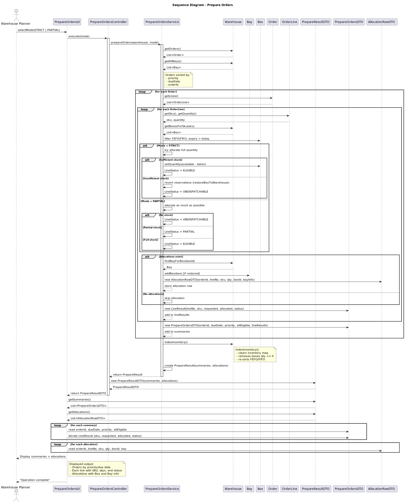

### User Story

As a warehouse planner, when I receive open orders, I want the
system to examine current inventory and allocate quantities from boxes in FEFO
order, and produce per-line statuses (ELIGIBLE, PARTIAL, UNDISPATCHABLE)
and a list of allocation rows with box and bay information.

### Acceptance Criteria

1. Orders are processed by: priority ASC, dueDate ASC,
orderId ASC. Within an order, lines are processed by lineNo ASC (input order).
For each line, allocation walks the SKU’s boxes in FEFO/FIFO order.
For each visited bay, allocate take min(remainingQty, box.qtyAvailable), reduce
remainingQty, and continue until the request is satisfied or boxes end. The available
box quantity never goes below zero during planning.
The system supports two modes: flag eligibility strict, partial, the default is
strict:
- strict: a line is ELIGIBLE only if its entire requested quantity is allocated;
otherwise it is UNDISPATCHABLE (no allocations for that line are kept).
- partial: if 0 ¡ allocated ¡ requested, mark the line PARTIAL and keep the
allocated portion; if allocated = 0, mark UNDISPATCHABLE.

### Returns

The system returns a structured result containing order summaries and detailed stock allocations.  
Each order summary includes the order’s ID, due date, priority, and the allocation status of each line (ELIGIBLE, PARTIAL, or UNDISPATCHABLE).  
For each allocated item, an allocation record is created with the corresponding SKU, quantity, box ID, and bay location.  
These results are combined into a single `PrepareResultDTO`, which is displayed in the user interface alongside the updated warehouse inventory.  
The process ensures that the final output clearly reflects how each order line was handled and how stock was consumed from the warehouse.

### Diagrams

## System Sequence Diagram

## Class Diagram

## Sequence Diagram

#### Done 

**Order Preparation**  
The system successfully executes the *Prepare Orders* operation through the `PrepareOrdersController`, which coordinates between the UI, domain model, and service layer.  
All existing orders in the warehouse are loaded, sorted, and validated based on their **priority**, **due date**, and **order ID** to ensure that urgent orders are processed first.  
Each order line is evaluated according to available inventory in **FEFO/FIFO order**, ensuring that the most appropriate stock is allocated while maintaining correct dispatch sequencing.

**Strict Mode (Full Allocation)**  
When the system runs in **STRICT mode**, each order line must be **fully allocatable** to be considered valid.  
If the available stock for a line is insufficient, the system automatically **reverts all temporary reservations**, restoring box quantities to their original state and marking the line as **UNDISPATCHABLE**.  
This guarantees that only orders which can be completely fulfilled are prepared for dispatch, avoiding partial shipments.

**Partial Mode (Flexible Allocation)**  
In **PARTIAL mode**, the system allows orders to be **partially fulfilled**.  
Boxes are reserved sequentially according to **FEFO/FIFO logic** until stock runs out or the requested quantity is reached.  
If stock is insufficient, the remaining unfulfilled quantity is recorded, and the line is marked as **PARTIAL**, while completed lines are marked **ELIGIBLE**.  
This enables flexible allocation while preserving stock traceability and correct rotation.

**Inventory and Allocation Management**  
For every successful reservation, the system generates an `AllocationRowDTO`, recording the **order ID**, **line number**, **SKU**, **allocated quantity**, **box ID**, and the **exact bay location (warehouse/aisle/bay)**.  
Once all allocations are complete, the system updates the warehouse’s internal index (`inventoryBySku`) using `Warehouse.indexInventory()`, removing empty boxes and ensuring that all remaining stock is properly re-sorted by FEFO/FIFO order.

**Summaries and Reporting**  
After processing, a `PrepareResultDTO` is produced, containing two detailed lists:  
1. **Summaries** (`PrepareOrdersDTO`) — describing each order, priority, due date, and the status of every line (ELIGIBLE, PARTIAL, or UNDISPATCHABLE).  
2. **Allocations** (`AllocationRowDTO`) — containing all physical stock movements and assigned quantities.  
The results are displayed in the UI, showing clear status feedback for each order line and overall order completion status.

**Quality**  
The *Prepare Orders* process has been validated under multiple scenarios (strict vs partial modes, empty warehouses, invalid SKUs, expired boxes, competing orders).  
Comprehensive tests confirm that:  
- Orders are always processed in the correct **priority and date order**.  
- **FEFO/FIFO allocation rules** are respected for every SKU.  
- Stock integrity and inventory consistency are maintained after allocation.  
- Invalid or expired stock is safely ignored without breaking the flow.  
- The system passes all **unit**, **integration**, and **performance** tests, ensuring reliability and reproducibility across all warehouse configurations.

### Test Cases

| **Test Name** | **Description** | **Expected Result** |
|----------------|-----------------|---------------------|
| **Controller Returns Valid Result Object** | Checks if the controller returns a valid result with summaries and allocations. | A non-null result with filled summaries and allocations. |
| **Executes Strict Mode Successfully** | Runs strict allocation with enough stock. | All lines eligible, one summary and one allocation created. |
| **Executes Partial Mode Successfully** | Runs partial allocation when stock is insufficient. | Line marked as PARTIAL, with partial quantity allocated. |
| **Handles Empty Warehouse Gracefully** | Runs with an empty warehouse (no data). | Returns empty summaries and allocations without errors. |
| **Produces Same Results As Service** | Compares controller and service direct outputs. | Both produce the same summaries and allocations. |
| **Result DTO Stores Data Correctly** | Checks if DTO fields are filled correctly after execution. | DTO contains correct order ID, SKU, and box information. |
| **Strict Mode - Fully Eligible** | Tests full allocation under strict mode. | Line marked ELIGIBLE; full quantity allocated. |
| **Partial Mode - Partially Allocates** | Tests allocation with limited stock under partial mode. | Partial quantity allocated; status is PARTIAL. |
| **Strict Mode - Reverts Partial Allocations** | Tests strict mode with insufficient stock. | Line marked UNDISPATCHABLE; box quantity unchanged. |
| **No Orders Produces Empty Results** | Runs when there are no orders in the warehouse. | Both summaries and allocations lists are empty. |
| **Orders Sorted By Priority And Date** | Tests correct sorting of orders by priority/date. | Higher-priority orders are processed first. |
| **Expired Boxes Are Ignored** | Ensures expired boxes aren’t used for allocation. | No allocations created; line marked UNDISPATCHABLE. |
| **Invalid Expiry Date Is Accepted** | Checks handling of invalid expiry date format. | Box still used; line marked ELIGIBLE. |
| **Box Removed When Emptied** | Tests if boxes are deleted after full use. | Box list becomes empty after allocation. |
| **Boxes Removed When Fully Used** | Confirms that empty boxes are removed after use. | All boxes removed from the bay. |
| **Allocation Row Data Is Correct** | Verifies allocation data content (box, SKU, qty). | Allocation row contains correct order, SKU, qty, and box ID. |
| **Unknown SKU Becomes Undispatchable** | Tests behavior with a non-existing SKU in the order. | No allocations; line marked UNDISPATCHABLE. |
| **Multiple Lines In Same Order** | Handles multiple SKUs in a single order. | Both lines processed and marked ELIGIBLE. |
| **Multiple Orders Competing For Same Stock** | Tests allocation order when stock is limited. | First order ELIGIBLE, second order PARTIAL. |
| **No Bays Available** | Tests behavior when no bays exist in warehouse. | No allocations created. |
| **Warehouse Inventory Index Updated** | Checks if warehouse index updates after allocation. | SKU boxes removed or list becomes empty. |

