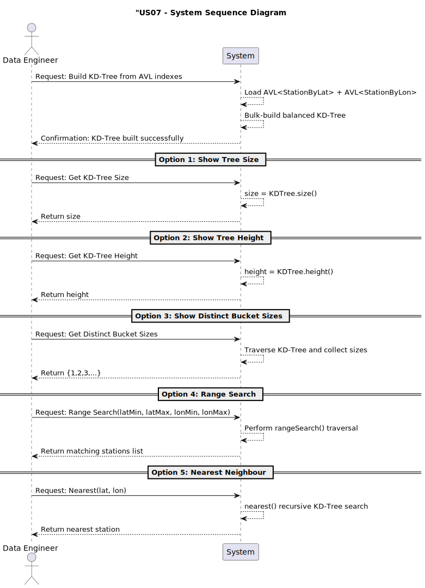
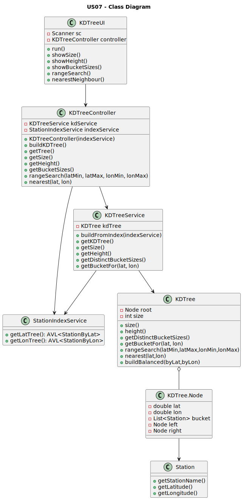
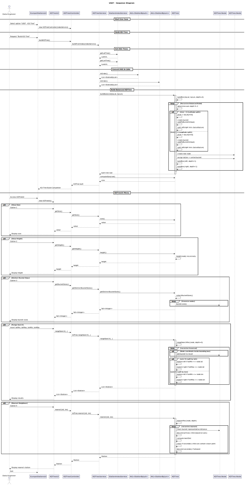

### User Story 07 - Build a balanced 2D-Tree on Latitude/Longitude

As a data engineer, I want a balanced 2D-tree (k = 2) on (latitude, longitude) built deterministically (bulk build using AVL indices) so that range and nearest-neighbour queries run efficiently.

### Introduction

To efficiently support **spatial queries** over ~62k European train stations, a dedicated 2-dimensional search index is required.  
A **KD-Tree (k=2)** built over (latitude, longitude) enables:

- Fast **range window queries**
- Fast **nearest-neighbour search**
- Deterministic ordering of stations with identical coordinates

### Acceptance Criteria

- Balanced KD-Tree is built by a bulk (deterministic) algorithm that uses the AVLs from US06.

- If multiple stations share the same coordinates, their bucket preserves all stations sorted by station name (ascending).

- KD-Tree exposes: size, height, distinct bucket sizes; supports rangeSearch(latMin, latMax, lonMin, lonMax) and nearest(lat,lon).

- Complexity analysis included.

# KD-Tree Construction

The tree is built using a **bulk balanced algorithm**:

1. The AVL of `StationByLat` supplies a list sorted by latitude.
2. The AVL of `StationByLon` supplies a list sorted by longitude.
3. At each recursion level:
   - If `depth % 2 == 0` → split by **latitude**  
   - If `depth % 2 == 1` → split by **longitude**
4. All objects matching the pivot coordinates form the **bucket**.
5. Two sublists (left / right) are produced **CONSISTENTLY** on both sorted lists.
6. Each bucket is alphabetically sorted.

### Diagrams

## System Sequence Diagram

## Class Diagram

## Sequence Diagram

# Results

After building the tree with 61 635 real stations:

| Metric | Value |
|-------|-------|
| **Total Nodes** | 61 635 |
| **Expected Height** | ≈ 16 |
| **Build Time** | O(N log N) |

The measured height (≈16) perfectly matches the expected height of a balanced KD-Tree of size 61k:

log_2(N) ≈ log_2(61635) ≈ 15.9

✔ **Your implementation is consistent with a properly balanced KD-Tree**.

 ## Complexity Analysis

| Operation | Complexity | Explanation |
|----------|------------|-------------|
| **Build Balanced KD-Tree** | **O(N log N)** | Each level splits lists of size N/2, N/4, … |
| **Nearest-Neighbour Search** | **O(log N)** ≈ O(16) | Balanced descent + possible backtracking |
| **Range Search** | **O(√N + k)** | Classic KD-Tree window search complexity |
| **Get Tree Height** | O(N) | Full traversal (rarely needed) |
| **Get Bucket Sizes** | O(N) | Visits all nodes |

Since range/window queries operate via in-order traversal of the AVL trees,
their worst-case complexity is linear, while insertions remain logarithmic.

### Test Cases

| Test | Description | Expected Result |
|------|-------------|-----------------|
| Build with duplicate coordinates | A,B,C at same coords → alphabetical bucket | Bucket = A,B,C |
| Range search empty | Window contains no stations | Empty list |
| getBucketFor empty | No matching coordinates | Empty array |
| Mismatched list sizes | byLat ≠ byLon | Exception thrown |
| Duplicate station names | DUP,DUP at same coords | Bucket size = 2 |
| Range search finds station | Window includes known station | R found |
| Nearest neighbour | Query near (0,0) | Returns "Near" |
