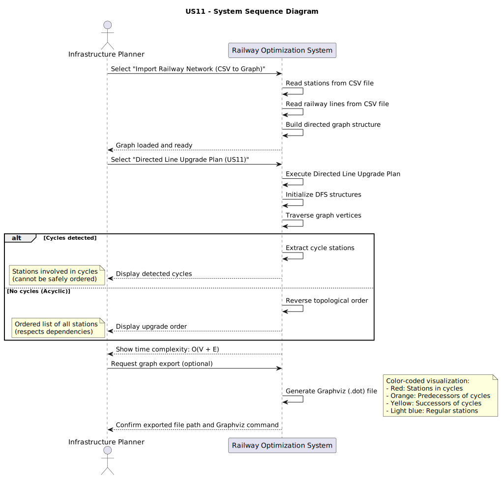
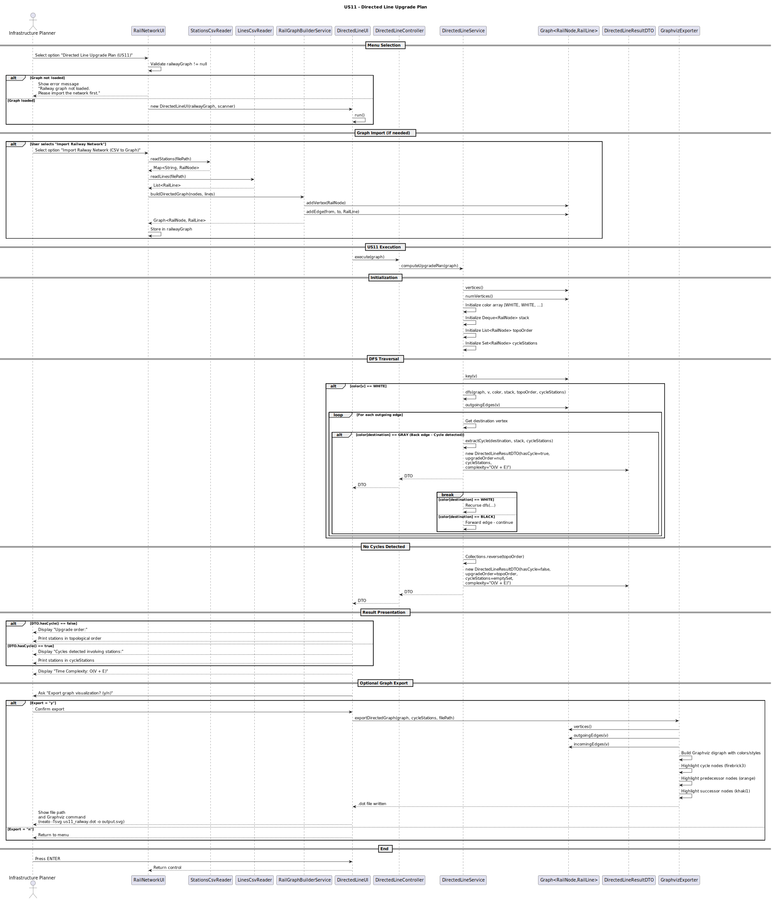
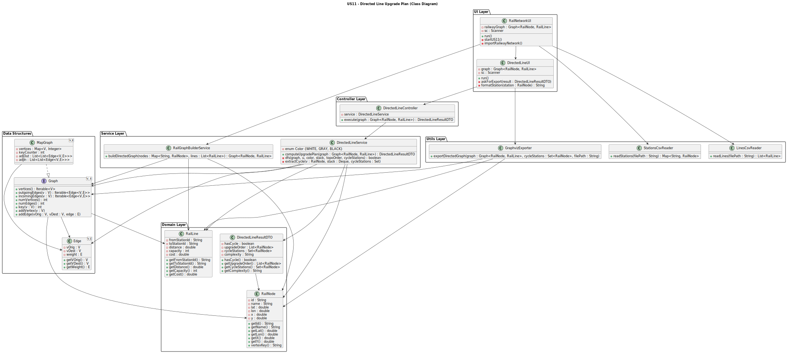

# User Story 11 — Directed Line Upgrade Plan

## Compute a Directed Upgrade Plan with Cycle Detection

As an **infrastructure planner**, I want to analyse the **directed railway network** to determine a safe **upgrade order of stations**, detecting cycles that prevent a linear upgrade plan.

---

## Introduction

Railway upgrade operations often depend on **directional constraints** between stations (e.g., signalling dependencies, power distribution order).  
The railway network is therefore modelled as a **directed graph**, where:

- **Vertices** represent railway stations  
- **Directed edges** represent upgrade dependencies  

This User Story computes a **Directed Line Upgrade Plan**, identifying whether the graph is **acyclic** and, if so, producing a valid **topological upgrade order**.

---

## Acceptance Criteria

- Railway network is treated as a **directed graph**
- Cycles are detected deterministically
- If the graph is **acyclic**:
  - A valid **upgrade order** is returned
- If cycles exist:
  - All stations involved in cycles are identified
- The result includes:
  - Cycle existence flag
  - Upgrade order
  - Stations in cycles
  - Time complexity
- A **Graphviz DOT representation** of the directed graph is generated

---

## Directed Upgrade Plan Algorithm

The algorithm follows a **graph traversal and dependency analysis** strategy:

1. Traverse the directed graph
2. Detect cycles using DFS with a recursion stack
3. If no cycles are found:
   - Produce a **topological ordering**
4. If cycles exist:
   - Collect all stations involved in cycles
5. Package the result into a `DirectedLineResultDTO`

---

## Diagrams

### System Sequence Diagram (SSD)

### Sequence Diagram (SD)

### Class Diagram (CD)

## Results

| Output | Description |
|------|------------|
| **hasCycle** | Indicates whether cycles exist |
| **upgradeOrder** | Valid upgrade order if acyclic |
| **cycleStations** | Stations involved in cycles |
| **DOT file** | Visual representation of the directed graph |

---

## Complexity Analysis

| Operation | Complexity | Explanation |
|---------|------------|-------------|
| Cycle detection | **O(V + E)** | DFS traversal |
| Topological sort | **O(V + E)** | Standard DAG ordering |
| Graph export | **O(V + E)** | Iterates over vertices and edges |

✔ Efficient for large railway networks.

---

## Test Coverage

- Acyclic graph produces valid upgrade order
- Graph with simple cycle detected correctly
- Multiple independent cycles detected
- Dense directed graph
- End-to-end test via UI → Controller → Service

