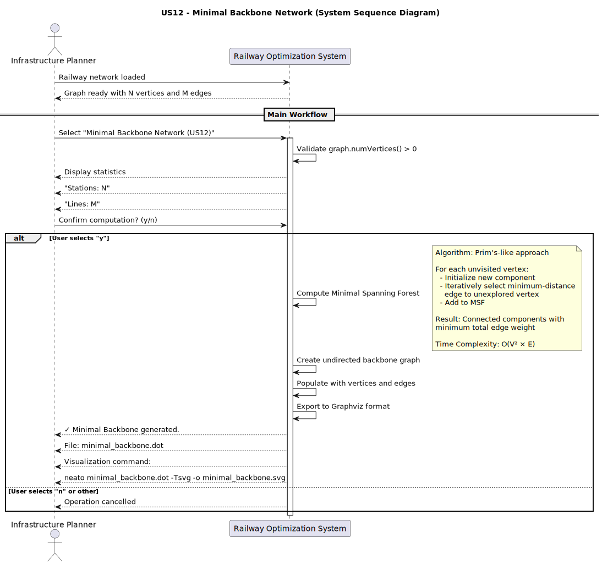
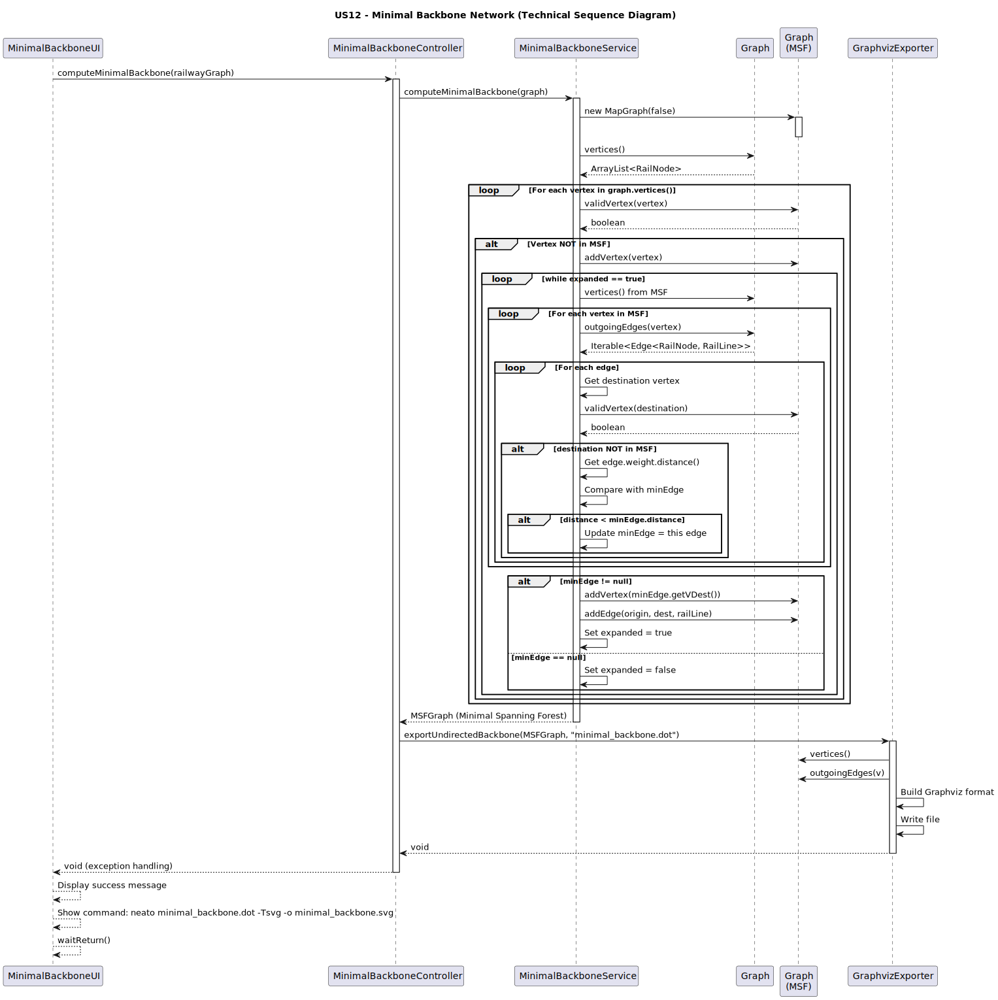
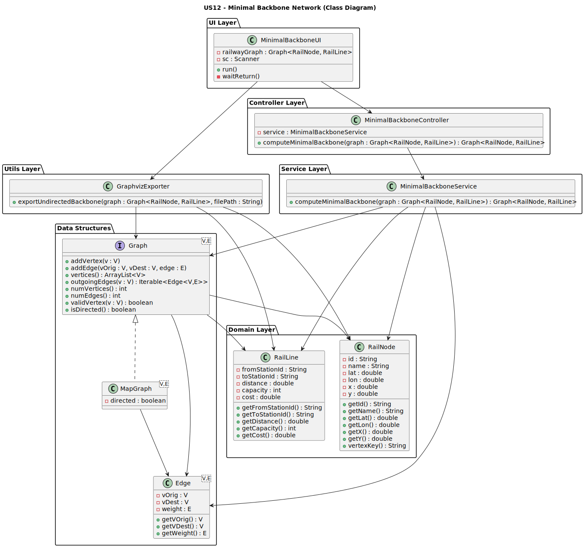

# User Story 12 — Minimal Backbone Network

## Compute a Minimal Backbone Network (Undirected MST)

As an **infrastructure planner**, I want to compute a **minimal railway backbone** that connects all stations with **minimum total track length**, to estimate maintenance or expansion costs.

---

## Introduction

To estimate a **cost baseline** for railway infrastructure planning, it is necessary to extract a **minimal subset of tracks** that connects all reachable stations.

The railway network is treated as an **undirected weighted graph**, where:
- Vertices represent stations
- Edge weights represent track distances

The goal is to compute a **Minimum Spanning Tree (MST)**, referred to as the **Minimal Backbone Network**.

---

## Acceptance Criteria

- Railway graph is treated as **undirected**
- All stations are connected with **minimum total distance**
- Resulting graph contains:
  - Same number of vertices
  - Exactly **V − 1 edges** (when connected)
- DOT file places each station at its **XY coordinates**
- SVG file generated using Graphviz **neato**
- Complexity analysis included

---

## Minimal Backbone Algorithm

A **Prim-style greedy algorithm** is used:

1. Start from an arbitrary station
2. Repeatedly select the **minimum-distance edge**
   connecting the current tree to an unvisited station
3. Add the edge and station to the backbone
4. Repeat until all stations are included

---

## Diagrams

### System Sequence Diagram (SSD)

### Sequence Diagram (SD)

### Class Diagram (CD)

## Results

| Metric | Value |
|------|------|
| **Vertices** | Same as original graph |
| **Edges** | V − 1 |
| **Graph Type** | Undirected |
| **Output** | DOT + SVG |

---

## Complexity Analysis

The algorithm uses a **Prim-style Minimum Spanning Forest (MSF)** approach, specifically designed to handle disconnected graphs:

### Time Complexity

| Operation | Complexity | Details |
|---------|------------|---------|
| **MSF Computation** | **O(V² × E)** | Naive Prim for each component: V iterations × V vertices × E edges |
|Isolated vertex removal|**O(V)**|Single pass over isolated nodes |
| **Graph Export to DOT** | **O(V + E)** | Single iteration over vertices and edges |
| **Total** | **O(V² × E)** | MSF dominates |

## Test Coverage

### Test Cases

| Test | Description | Expected Result |
|------|-------------|-----------------|
| **Connected Linear** | 8-node linear chain A-B-...-H | 8 vertices, 7 edges (V-1) |
| **Minimal Edge Selection** | Frontier with variable weights | Always selects minimum-weight edge |
| **Cycle Prevention** | Graph with cycle opportunity | Backbone has 7 edges, no cycles |
| **Equal-Weight Edges** | Multiple edges with weight=5 | Handles consistently, produces MSF |
| **Greedy Correctness** | Cheap cycle vs. expensive direct edge | Avoids greedy trap, selects optimal path |
| **Dense Graph** | Complete graph K_8 (28 edges) | 8 vertices, 7 edges, fully connected |
| **Disconnected Components** | 2 separate connected components | Only reachable vertices included |
| **Single Node** | Graph with 1 station | 1 vertex, 0 edges |
| **Equal-Weight Pairs** | 2 edges from A with same weight | Both weights handled consistently |
| **Isolated Vertex Removal** | Graph with unreachable station | Isolated vertices removed from backbone |
| **Multiple Components** | 2 components linked by bridge | MSF spans both components optimally |
| **Minimal Path Selection** | Triangle: 1→2→3 vs direct 1→3 | Selects cheaper path via intermediate vertex |
| **Connectivity Guarantee** | Dense K_5 graph | All 5 vertices remain connected |
| **Negative Weights** | Weights: -5, 0, +100 | Handles edge cases correctly |
| **Controller - Complex Graph** | 8-node directed backbone | Correct vertex count and edge count |
| **Controller - Isolated Vertices** | 3 reachable + 1 isolated | Isolated removed, 3 vertices remain |
| **Controller - Dense Graph** | Complete K_6 graph | 6 vertices, 5 edges |
| **End-to-End** | Full pipeline with DOT export | SVG generated successfully with XY coordinates |

